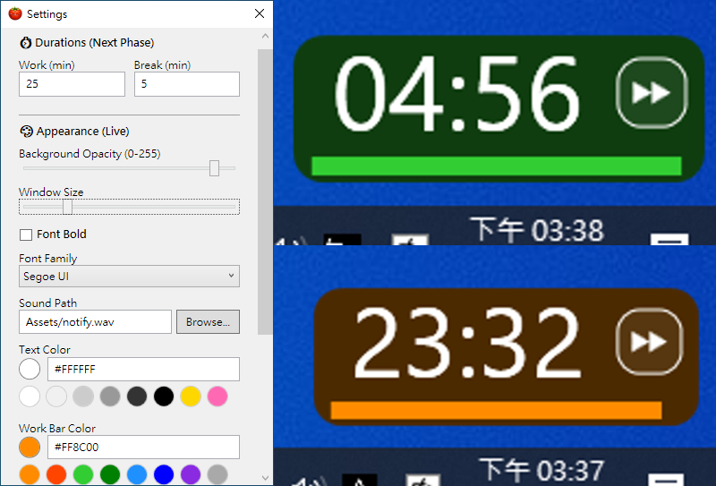

# Clock - Minimalist Pomodoro Timer


 


<p align="center">
  
</p>

A minimalist, unobtrusive Pomodoro timer with real-time Android synchronization. 
Built with .NET 10 (WPF) and Native Android (Kotlin + Jetpack Compose).

## 🚀 New in v1.1.9: Pixel Reliability & Low-Latency Audio

*   **AlarmClock Integration**: Upgraded from standard alarms to `setAlarmClock()`. This is the highest priority trigger in Android, effectively bypassing Pixel's aggressive battery optimizations and ensuring phase transitions are never delayed in deep sleep.
*   **SoundPool Engine**: Replaced MediaPlayer with `SoundPool`. Audio is now pre-loaded into memory and routed through the **Alarm/Notification stream**. This eliminates the 10-second "audio focus" delay when playing music via Bluetooth.
*   **Android 14 Hardening**: Implemented the `USE_EXACT_ALARM` permission for automatic authorization on newer Android versions. Added a **Triple-Fallback** mechanism to ensure the app never crashes due to permission changes.
*   **Notification Fixes**: Optimized notification channel priority and categories (`CATEGORY_ALARM`) to restore custom stage colors and prevent notifications from being hidden by Android's adaptive battery on the lock screen.

## 🚀 New in v1.1.8: Unified Target Architecture & Stability

## 🚀 New in v1.1.7: Background Precision & Sound Deduplication

*   **AlarmManager Integration**: Uses `setExactAndAllowWhileIdle` for sound triggering, bypassing Android's Doze Mode restrictions.
*   **Sound Deduplication**: Implemented a `lastPlayedTargetTime` lock to prevent "double sounds" when waking up from background or transitioning between power modes.
*   **Safety Net**: Added a background monitor that forces a phase transition if the system alarm is delayed by more than 1 second, preventing the timer from getting stuck at zero.

## 🚀 New in v1.1.6: Reliability & Sync Fixes

*   **Fixed Screen-Off Time Freeze**: The timer now correctly tracks elapsed time while the screen is off by utilizing a persistent time reference and a 1s "Power-Efficient Tick".
*   **Intelligent Sound Re-Sync**: Android now monitors sync drift from the PC. If the remaining time jumps by more than 2 seconds (e.g., during initial connection or manual duration changes), the notification sound is automatically rescheduled to stay perfectly aligned.
*   **Clean Task Exit**: Swiping the app away from the Android Recents list now properly terminates the background service and removes the notification, ensuring a predictable lifecycle.
*   **Pause/Resume Robustness**: Improved time tracking logic to prevent "time jumps" when resuming from a paused state or transitioning between power modes.

## 🚀 New in v1.1.5: Power Optimization & Logic Fixes

*   **Adaptive Ticking (Android)**: Optimized battery usage by adjusting computation frequency based on app state:
    *   **Foreground**: 50ms (for smooth animations).
    *   **Background**: 1s (to update notification bar).
    *   **Screen Off**: **Power-Efficient Tick** (1s). CPU maintains logic consistency without excessive wakeups.
*   **Scheduled Sound Triggers**: Replaced high-frequency polling with a Coroutine-based "Pre-set Alarm" mechanism. Sound triggers accurately even when the CPU is sleeping.
*   **Automatic Phase Cycling**: Standalone mode now correctly cycles through Work/Break phases without manual intervention.
*   **Robust Sync Transitions**: 
    *   **Auto-Resume**: Manual phase switching no longer causes unintended pauses.
    *   **Graceful Disconnect**: App now automatically resets to defaults and cancels alarms when the PC connection is lost or the PC app is closed.
*   **Consistent APK Signing**: Fixed the "App not installed" error during updates. From v1.1.5 onwards, you can directly overwrite previous versions without uninstalling.

## 🚀 New in v1.1.3: Security & Privacy Hardening

*   **Secure Settings Migration (PC)**: `setting.json` is now stored in `%LocalAppData%\Clock` for better permission management and system compliance. Automatic migration from the old location is included.
*   **Privacy-First Notifications (Android)**: Notification visibility is now set to `PRIVATE` to protect timer details on the lock screen.
*   **Restricted Network Access**: PC-side CORS policies are now tightened to prevent unauthorized cross-origin requests from browsers.
*   **Enhanced Input Validation**: 
    *   **Android**: Strict IP/Hostname validation for PC discovery to prevent SSRF.
    *   **Both**: Hex color validation to prevent crashes from malformed settings.
*   **PowerShell Safety**: Improved startup script generation with proper string escaping.
*   **Battery Optimization**: Android mDNS scanning now automatically stops after a successful connection to save power.

## 🚀 New in v1.1.1: Background Service & CI/CD Release

*   **Background Sync**: Android app now stays connected in the background using a Foreground Service.
*   **Notification Countdown**: Real-time countdown (MM:SS) directly in your Android notification bar with stage-specific accent colors and "Public" visibility for lock screens.
*   **Local Settings (Android)**: Customize Work/Break durations and accent colors directly on your phone.
*   **Keep Screen On**: Option to prevent Android devices from sleeping while the app is in focus.
*   **System Audio Integration**: Android client automatically uses your phone's default notification sound—or choose any system ringtone via the new settings menu.
*   **Console Toggle**: PC users can now hide/show the developer console window via the Settings GUI.
*   **Automated APK Builds**: GitHub Actions now provides both `.exe` and `.apk` in the Release section.

## 🚀 New in v1.1.0: Android Sync

*   **Real-time Sync**: Synchronize time, phase (Work/Break), and pause status between PC and Phone.
*   **Automatic Discovery**: Uses mDNS to automatically find your PC on the local network.
*   **Tailscale Support**: Full compatibility with Tailscale VPN for syncing across different networks.
*   **High-Precision Engine**: Both PC and Mobile now use UTC timestamp-based calculations to eliminate clock drift.
*   **Standalone Mode**: App automatically degrades to a standalone timer when disconnected.

## ✨ Features

*   **Minimalist Widget**: Frameless window that sits quietly on your desktop.
*   **Always Visible**: Smart positioning logic ensures it stays on top of your taskbar but doesn't block your work.
*   **Two-Phase Cycle**: Simple "WORK" and "BREAK" phases with visual progress indicators.
*   **Dynamic Theme Background**: Background color automatically adjusts to a darker version of the current phase color.
*   **Instant Interaction**: Click the progress bar to pause/resume, one-click phase switching via modern icon buttons (⏩).
*   **Visual Feedback**: Progress bar and buttons highlight on hover to indicate interactability.
*   **Hacker-Friendly Config**: Customize colors, fonts, and behavior via `setting.json` or a comprehensive graphical interface.
*   **Modern Settings GUI**: Intuitive color pickers, font family dropdown, and audio file browser.
*   **Run at Startup**: Option to automatically start with Windows.
*   **Android Mobile UI**: Circular progress bar design with native touch controls.

## 🛠 Installation & Setup

### 🖥 Windows (Host)
1. Download the latest release (or build from source).
2. Run `clock.exe`.
3. **Firewall Note**: Ensure **Port 8888 (TCP)** is allowed. 
   - *Pro Tip*: If your network is set to "Public", you must manually enable the "Public" profile in Windows Advanced Firewall settings for the app.

### 📱 Android (Client)
1. Download the `clock.apk` from the latest GitHub Release.
2. Install the APK on your Android device (ensure "Install from unknown sources" is allowed).
3. Ensure your phone is on the same Wi-Fi or connected via Tailscale.
4. Tap the **Sync icon** (top right) and select your PC from the list, or enter the IP manually.

### 🎵 Important: Sound Effects Setup

To respect copyright laws, **the Windows version does not include sound files**. 
*   **Windows**: You need to provide your own sound. Place a `.wav` file in the `Assets` folder and rename it to `notify.wav`, or use the "Browse..." button in Settings.
*   **Android**: Automatically uses your system's default notification sound. No setup required.

## ⚙️ Configuration (`setting.json`)

**Windows (Host)**: The `setting.json` file is stored in `%LocalAppData%\Clock\setting.json`. You can edit this file manually or open the "Settings" window from the application UI.

**Android (Client)**: Settings are managed directly within the App's "Settings" screen and stored in the app's private storage.

### Config Properties:

```json
{
  "WorkDuration": 25,          // Minutes
  "BreakDuration": 5,           // Minutes
  "BackgroundAlpha": 200,      // 0-255 (Transparency)
  "WindowSize": 50,            // Widget size
  "FontFamily": "Segoe UI",
  "TextColor": "White",
  "IsBold": true,
  "Volume": 50,                // 0-100
  "WorkColor": "#FF8C00",      // Hex color
  "BreakColor": "#32CD32",
  "SoundPath": "Assets/notify.wav",
  "IsStartupEnabled": false
}
```

## 🏗 Architecture & Development

### Project Structure
*   **`clock.Lib`**: Core Pomodoro logic, purely .NET 10 (UI-independent).
*   **`clock`**: Windows WPF view layer and SignalR Host (Port 8888).
*   **`clock-android`**: Native Android app using Jetpack Compose and SignalR Kotlin Client.

### Requirements
*   .NET 10 SDK
*   Visual Studio 2022 / VS Code
*   Android Studio (for mobile app)

### Build
```bash
dotnet build
```

## 📜 License & Credits

MIT License. Created by **Google Gemini** (AI).
Concept: A simplified, synchronized Pomodoro timer for multi-device focus.