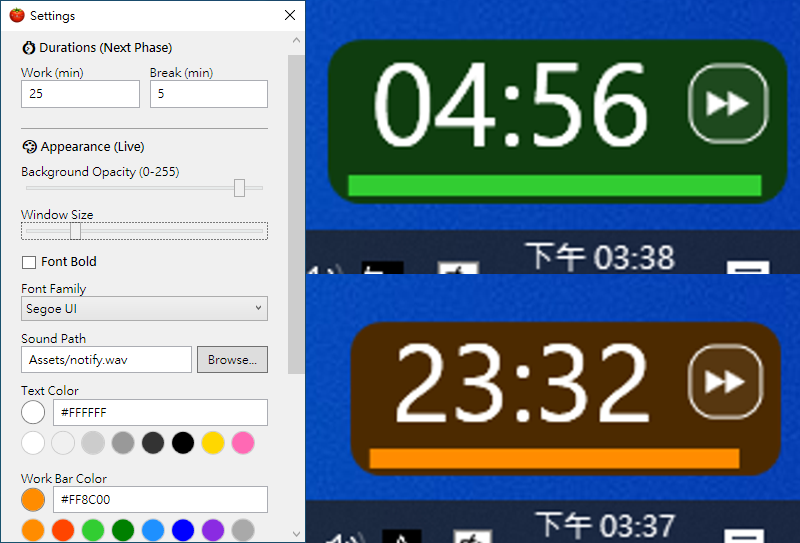

# Clock - Minimalist Pomodoro Timer


 


<p align="center">
  
</p>

A minimalist, unobtrusive Pomodoro timer with real-time Android synchronization.
Built with .NET 10 (WPF) and Native Android (Kotlin + Jetpack Compose).

## Security Notice

> This project is currently best treated as a prototype-grade application from a security hardening perspective.
> Use it only on trusted networks, and do not assume the current desktop/mobile builds are hardened production releases.
> If you deploy sync features beyond your own devices, review signing, network exposure, and access controls before relying on it in a broader environment.

## ✨ Features

*   **Minimalist Widget**: Frameless window that sits quietly on your desktop.
*   **Always Visible**: Smart positioning logic ensures it stays on top of your taskbar but doesn't block your work.
*   **Two-Phase Cycle**: Simple "WORK" and "BREAK" phases with visual progress indicators.
*   **Dynamic Theme Background**: Background color automatically adjusts to a darker version of the current phase color.
*   **Instant Interaction**: Click the progress bar to pause/resume, one-click phase switching via modern icon buttons (⏩).
*   **Visual Feedback**: Progress bar and buttons highlight on hover to indicate interactability.
*   **Hacker-Friendly Config**: Customize colors, fonts, and behavior via `setting.json` or a comprehensive graphical interface.
*   **Modern Settings GUI**: Intuitive color pickers, font family dropdown, and audio file browser.
*   **Run at Startup**: Option to automatically start with Windows.
*   **Android Mobile UI**: Circular progress bar design with native touch controls.

## 🛠 Installation & Setup

### 🖥 Windows (Host)
1. Download the latest release (or build from source).
2. Run `clock.exe`.
3. **Firewall Note**: Ensure **Port 8888 (TCP)** is allowed. 
   - *Pro Tip*: If your network is set to "Public", you must manually enable the "Public" profile in Windows Advanced Firewall settings for the app.

### 📱 Android (Client)
1. Download the `clock.apk` from the latest GitHub Release.
2. Install the APK on your Android device (ensure "Install from unknown sources" is allowed).
3. Ensure your phone is on the same Wi-Fi or connected via Tailscale.
4. Tap the **Sync icon** (top right) and select your PC from the list, or enter the IP manually.

### 🎵 Important: Sound Effects Setup

To respect copyright laws, **the Windows version does not include sound files**. 
*   **Windows**: You need to provide your own sound. Place a `.wav` file in the `Assets` folder and rename it to `notify.wav`, or use the "Browse..." button in Settings.
*   **Android**: Automatically uses your system's default notification sound. No setup required.

## ⚙️ Configuration (`setting.json`)

**Windows (Host)**: The `setting.json` file is stored in `%LocalAppData%\Clock\setting.json`. You can edit this file manually or open the "Settings" window from the application UI.

**Android (Client)**: Settings are managed directly within the App's "Settings" screen and stored in the app's private storage.

### Config Properties:

```json
{
  "WorkDuration": 25,          // Minutes
  "BreakDuration": 5,           // Minutes
  "BackgroundAlpha": 200,      // 0-255 (Transparency)
  "WindowSize": 50,            // Widget size
  "FontFamily": "Segoe UI",
  "TextColor": "White",
  "IsBold": true,
  "Volume": 50,                // 0-100
  "WorkColor": "#FF8C00",      // Hex color
  "BreakColor": "#32CD32",
  "PausedColor": "#1E90FF",    // Background/bar color while paused
  "IsPauseBlinkEnabled": false, // Blink the paused text
  "SoundPath": "Assets/notify.wav",
  "IsStartupEnabled": false
}
```

## 🏗 Architecture & Development

### Project Structure
*   **`clock.Lib`**: Core Pomodoro logic, purely .NET 10 (UI-independent).
*   **`clock`**: Windows WPF view layer and SignalR Host (Port 8888).
*   **`clock-android`**: Native Android app using Jetpack Compose and SignalR Kotlin Client.

### Requirements
*   .NET 10 SDK
*   Visual Studio 2022 / VS Code
*   Android Studio (for mobile app)

### Build
```bash
dotnet build
```

## 📜 License & Credits

MIT License. Created by **Google Gemini** (AI).
Concept: A simplified, synchronized Pomodoro timer for multi-device focus.